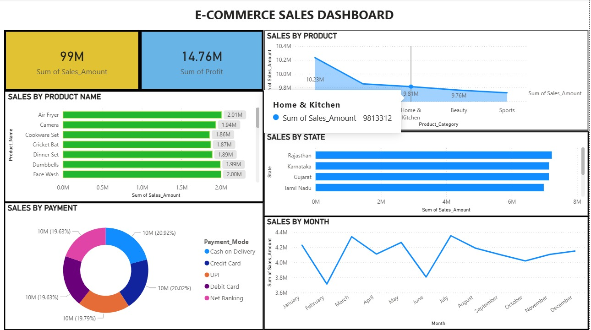

# 📊 E-Commerce Sales Analysis Dashboard

## 🚀 Overview
This project analyzes e-commerce sales data to uncover insights on revenue, profit, product performance, and customer behavior.  
An interactive dashboard was built using **Power BI** to support data-driven decision-making.

---

## 🎯 Objectives
- Analyze overall sales and profit performance  
- Identify top-performing products and categories  
- Understand regional sales distribution  
- Evaluate payment method preferences  
- Track monthly sales trends  

---

## 🛠️ Tools & Technologies
- Power BI  
- Microsoft Excel  
- Data Cleaning & Transformation  
- Data Visualization  

---

## 📊 Key Metrics
- 💰 Total Sales: **99M**  
- 📈 Total Profit: **14.76M**  

---

## 📈 Key Insights

### 🛍️ Product Performance
- Top products like **Air Fryer, Face Wash, and Dumbbells** generated ~2M in sales each  
- High demand observed in **Home & Kitchen** and **Personal Care** categories  

---

### 🏷️ Category Analysis
- **Home & Kitchen** is the leading category in revenue (~10M+)  
- Followed by **Beauty** and **Sports**  
- Indicates strong customer preference in these segments  

---

### 🌍 Regional Sales
- Top-performing states:
  - Rajasthan  
  - Karnataka  
  - Gujarat  
  - Tamil Nadu  
- These regions contribute significantly to total revenue  

---

### 💳 Payment Analysis
- Payment methods are evenly distributed across:
  - Cash on Delivery  
  - Credit Card  
  - UPI  
  - Debit Card  
  - Net Banking  
- Indicates flexibility in customer payment preferences  

---

### 📅 Monthly Trends
- Sales fluctuate throughout the year  
- Peak sales observed in **March** and **July**  
- Indicates possible seasonal demand patterns  

---

## 📸 Dashboard Preview

---

## 💡 Business Recommendations
- Focus marketing on high-performing categories like **Home & Kitchen**  
- Maintain inventory for top-selling products  
- Target high-performing states with localized campaigns  
- Leverage seasonal trends for promotions  
- Offer multiple payment options to improve customer experience  

---

## 📁 Dataset
- Includes sales, product, category, state, and payment details  
- Used for exploratory data analysis and dashboard creation  

---

## 🧠 Learnings
- Performed end-to-end data analysis  
- Built interactive dashboards using Power BI  
- Extracted actionable insights for business decision-making  

---

## 🔗 Project Link
(Add your Power BI / GitHub link here)
